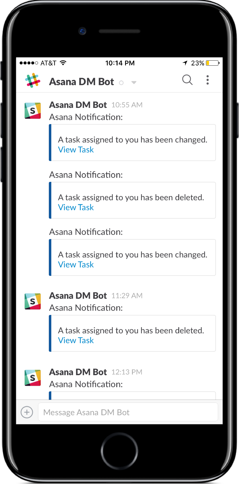

# memegenerator-messenger
A messenger bot to generate memes based on intuitive user interaction and input

Outline of functionality thus far:
 - User starts a new conversation with the bot in messenger
 - User is presented with a greeting text and menu to pick a type of meme to generate
 - After choosing from the persistent menu or quick replies, user is prompted for text to put into meme
 - The text is sent to and processed by the server
 - The server opens a headless browser window and runs a script to generate a `<canvas>` element, rendering the meme template and the user-provided text over it
 - The generated `<canvas>` image is saved to base64, and sent over an AJAX call back to the server, where it is processed, sent to AWS for storage and the link to the image on AWS sent as payload on a message to the user in messenger
 - The user receives the generated jpg as an attachment in messenger

 To configure:
 - `FB_VERIFY_TOKEN`, `FB_PAGE_ACCESS_TOKEN` : tokens from FB Messenger Developer API
 - `AWS_ACCESS_KEY_ID`, `AWS_SECRET_ACCESS_KEY`, `AWS_BUCKET_NAME` : AWS credentials for storing generated images. Can easily replace to use different static file storage service
 - `PHANTOM_URL` : url of deployed server in order to hit the endpoint when opening a headless browser window with Phantom
