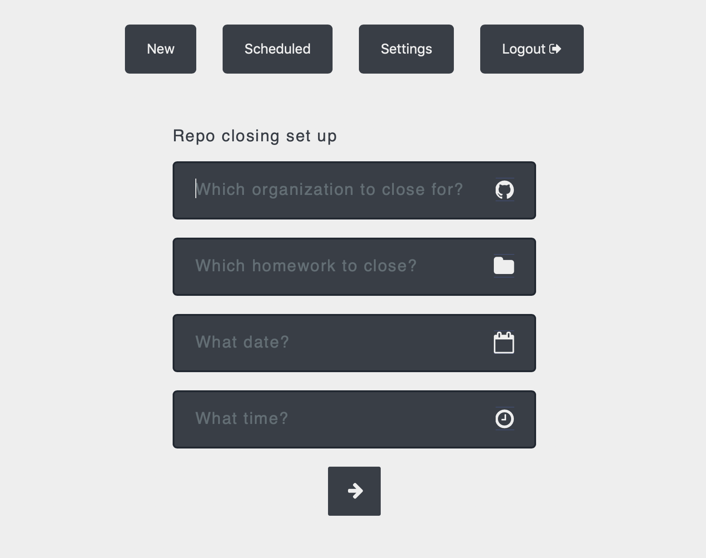
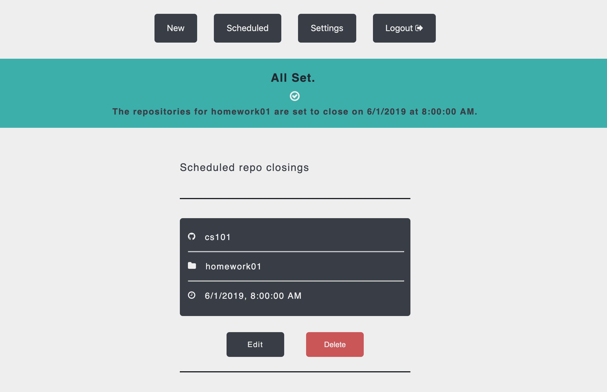

# Repo Closer
Bulk close and manage GitHub repositories for your organizations.

# Setup
- clone the repository, `cd` into `repo-closer` and `$ npm install`
- create a `students` file with no extension that will be used to close the repositories
- create a `config.json` file and add a `dbconf` key-value pair for the MongoDB database
- create a personal use token on GitHub with access permissions to organizations (must be owner of organizations for which to access/modify via API)
- start up the server by running `$ node ./bin/www`
- create a new user account by supplying the GitHub user token from previous step

# Closing repos
- once authenticated, click the 'New' page
- input the organization name
- input the name of the homework/assignment that should be closed (this is the prefix of the repo names following a naming convention of {STUDENT_ID}-{HW_NAME})
  - Example: for a student with id `id123` and for assignment `homework1` the repository name would look like `id123-homework1`; name to be inputed into repo closer is `homework1`, and all repositories matching this name will be closed according to the `students` file
- select the date at which to close the repositories
- select the time at which to close the repositories
- click the forward arrow, confirm with a confirmation message, and navigate to 'Scheduled' page to confirm that the repo closing is displayed in the list

# Updating repo closing
- click the 'Scheduled' page
- navigate to any available scheduled repo closing and click 'Edit'
- proceed to edit the date and time of the repo closing and click 'Update' to confirm the changes

# Deleting repo closing
- click the 'Scheduled' page
- navigate to any available scheduled repo closings and click 'Delete'
- confirm the prompt finalize the delete
