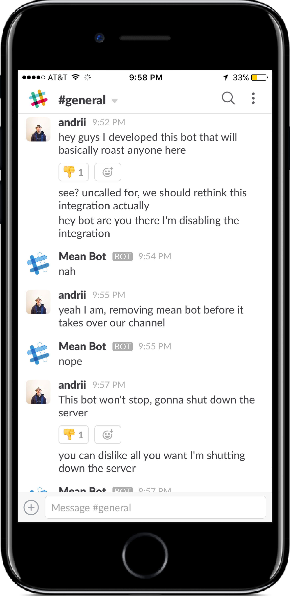

# slack-meanbot
A Slack bot for fun to mess with your teammates. Negatively answers and reacts at random to all messages sent by a particular user

- when set up with Slack API keys and tokens for your team and a user ID for one specific user, the bot will answer at random from the pre-defined responses available to choose from
- you can optionally configure the bot to respond with a bigger or different variety of responses, just add or edit the responses.txt file!
- parameters:
  BOT_AUTH_TOKEN, WEBHOOK_URI, EMOJI, MEANBOT_USER_ID
